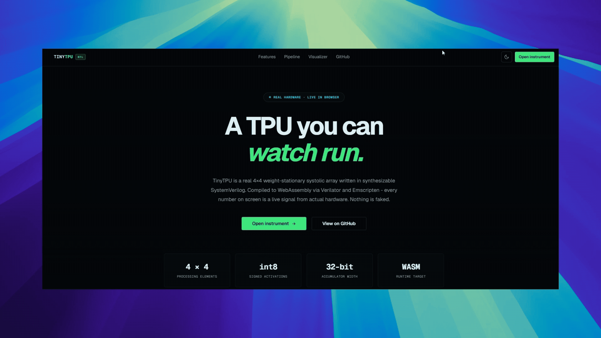
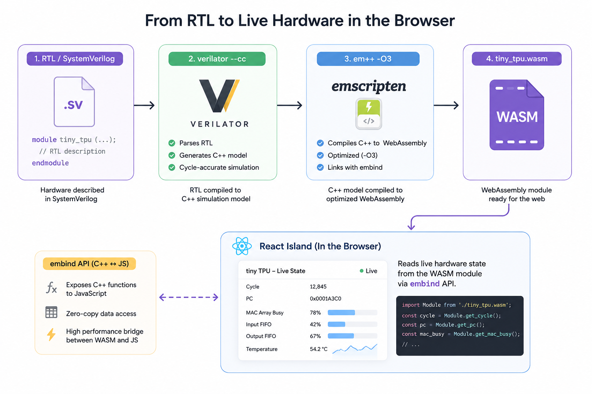

<div align="center">
  

  <h1>TinyTPU</h1>

  <p>
    <strong>A real, synthesizable 4×4 systolic array in SystemVerilog,<br>
    compiled to WebAssembly and running live in your browser.</strong>
  </p>

  <p>
    Every PE, every activation, every partial sum you see is a live hardware signal.<br>
    Nothing on screen is fabricated or reimplemented in JavaScript.
  </p>

  <p>
    <a href="LICENSE"></a>
    
    
    
    <a href="web/"></a>
    
  </p>

  <p>
    <a href="https://github.com/deaneeth/tiny-tpu/actions/workflows/rtl.yml"></a>
    <a href="https://github.com/deaneeth/tiny-tpu/actions/workflows/web.yml"></a>
    <a href="https://github.com/deaneeth/tiny-tpu/actions/workflows/wasm.yml"></a>
  </p>

  <p>
    <a href="https://tiny-tpu.vercel.app">
      
    </a>
    &nbsp;
    <a href="https://tiny-tpu.vercel.app/docs/how-it-works">
      
    </a>
  </p>
</div>

---

## 🎬 Preview

<div align="center">



</div>

Enter two int8 matrices. The browser executes the actual Verilog RTL (compiled to WebAssembly) cycle-by-cycle and animates every PE, every activation, and every partial sum straight from the hardware signals.

---

## ⚙️ How It Works

<div align="center">



</div>

The core insight: Verilator and Emscripten, chained together, turn synthesizable SystemVerilog into a WebAssembly module any browser can execute. The React visualizer is purely downstream of this: it reads state out of the compiled hardware binary.

<br>

| | What is real | Why it matters |
|:---:|:---|:---|
| 🔵 **Real RTL** | `rtl/*.sv` is synthesizable SystemVerilog: `always_ff`/`always_comb` only, no delays, no initial blocks, no inferred latches | Drop it into any FPGA synthesis tool without modification |
| 🟣 **Real WASM** | Verilator compiles RTL to cycle-accurate C++. Emscripten compiles that C++ to WebAssembly. The browser runs *compiled hardware* | Not a JavaScript reimplementation of the math |
| 🟢 **Real signals** | PE weights, activations, partial sums, and FSM phase come from an explicit debug output bus on `tiny_tpu_top` | The visualizer fabricates nothing; every number is traceable to a hardware port |

---

## 💎 Hardware Specs

A 4×4 weight-stationary systolic array computes `C = A · B` for signed int8 matrices in **14 clock cycles**:

| Phase | Cycles | Timeline | What happens |
|:---|:---:|:---|:---|
| `LOAD_WEIGHTS` | 4 | `████░░░░░░░░░░` | Matrix B loaded column-by-column into the PE grid as stationary weights |
| `STREAM` | 7 | `███████░░░░░░░` | Matrix A streams from the west edge with diagonal row-skew; MACs fire each cycle |
| `DRAIN` | 3 | `███░░░░░░░░░░░` | Final partial sums propagate out the south edge to the result buffer |
| **Total** | **14** | `██████████████` | **C = A · B complete. Signed int8 inputs, 32-bit accumulation.** |

**The MAC equation executed by every PE, every cycle:**

```
psum_out  <=  psum_in  +  (weight_reg  ×  act_in)
```

Row `i` of matrix A is delayed by `i` cycles (the *diagonal skew*) so each activation meets the correct stationary weight at precisely the right clock edge. For matrices larger than 4×4, the L3 view tiles into multiple 4×4 passes, each running on real RTL.

<br>

| Spec | Value |
|:---|:---|
| Array dimensions | 4 × 4 (16 processing elements) |
| MACs per cycle | Up to 16 (one per PE) |
| Input precision | Signed int8 |
| Accumulator width | Signed int32 |
| Synthesizable target | Any FPGA synthesis tool (no simulation-only constructs) |

---

## ✅ Why It Is Honest

Most hardware visualizers show a cartoon: a JavaScript reimplementation of the math dressed up with animations. TinyTPU does the opposite.

| Principle | In practice |
|:---:|:---|
| 🔒 **RTL is the only source of truth** | The frontend never reimplements the matmul. It reads state out of the compiled WASM binary. If the RTL is wrong, the visualizer shows the wrong thing. |
| ✔️ **Bit-exact golden verification** | The cocotb test suite asserts bit-exact equality between RTL output and a numpy reference model across 20+ random matrix pairs before anything ships. A wrong matmul is a beautiful lie. TinyTPU refuses to tell it. |
| 🚫 **No signal fabrication** | PE weights, activations, and partial sums come from an explicit debug output bus on `tiny_tpu_top`, not from reconstructed state, not from a shadow model, not from `public_flat`. |
| 🏗️ **Synthesizable by constraint** | The Verilog is not a testbench hack; it is the actual design, constrained to `always_ff`/`always_comb`, lint-clean under `-Wall`, and free of all simulation-only constructs. |

---

## 🛠️ Build from Source

All RTL tooling runs inside **WSL2 Ubuntu**. The frontend runs anywhere.

<details>
<summary><strong>Prerequisites (click to expand)</strong></summary>

```bash
# WSL2 Ubuntu system dependencies
sudo apt-get install -y build-essential cmake python3 python3-pip python3-venv \
    autoconf flex bison libfl2 libfl-dev

# Verilator 5.x (build from source)
git clone https://github.com/verilator/verilator && cd verilator
git checkout stable && autoconf && ./configure && make -j$(nproc) && sudo make install

# Emscripten SDK
git clone https://github.com/emscripten-core/emsdk && cd emsdk
./emsdk install latest && ./emsdk activate latest
source emsdk_env.sh

# Python virtualenv
python3 -m venv ~/.venvs/tinytpu && source ~/.venvs/tinytpu/bin/activate
pip install cocotb pytest numpy

# Node.js + pnpm
nvm install --lts && npm install -g pnpm
```

</details>

**Step 1: RTL lint**

```bash
verilator --lint-only -Wall rtl/*.sv
```

**Step 2: Simulation and golden verification**

```bash
source ~/.venvs/tinytpu/bin/activate
pytest sim/golden.py -q
```

**Step 3: WASM build**

```bash
bash wasm/build.sh
# outputs  web/public/tiny_tpu.mjs  +  web/public/tiny_tpu.wasm
```

**Step 4: Frontend dev server**

```bash
cd web && pnpm install && pnpm dev    # http://localhost:4321
```

---

## 📦 Tech Stack

| Layer | Technologies |
|:---|:---|
| **RTL** |   |
| **WASM** |   |
| **Frontend** |     |
| **Verification** |    |
| **Deploy** |  |

---

## 📁 Repository Structure

```text
tiny-tpu/
│
├── rtl/                        SystemVerilog source of truth
│   ├── pe.sv                   Single MAC cell (weight-stationary)
│   ├── systolic_array.sv       4×4 PE grid (generate loop)
│   ├── controller.sv           FSM: IDLE, LOAD_WEIGHTS, STREAM, DRAIN, DONE
│   └── tiny_tpu_top.sv         Top wrapper + debug output bus
│
├── sim/                        cocotb verification suite
│   ├── golden.py               numpy reference model (ground truth)
│   ├── test_pe.py              PE-level unit tests
│   ├── test_systolic_array.py  Array-level unit tests
│   └── test_top.py             Full matmul + cycle count tests
│
├── wasm/                       C++ harness to WASM bridge
│   ├── harness.cpp             TinyTpuSim class, reads the debug bus
│   ├── bindings.cpp            embind JS-callable surface
│   └── build.sh                verilator --cc + em++ build script
│
├── web/                        Astro + React + shadcn/ui frontend
│   ├── src/pages/              index.astro, app.astro, docs/
│   ├── src/components/         Visualizer, PEGrid, Controls, MatrixInput
│   ├── src/lib/                wasm-loader.ts, state-schema.ts
│   └── public/                 tiny_tpu.wasm (compiled artifact)
│
└── docs/
    └── STATE_SCHEMA.md         Per-cycle state contract (keep in sync with state-schema.ts)
```

---

## 📚 Documentation

| Doc | What it covers |
|:---|:---|
| [How it works](https://tiny-tpu.vercel.app/docs/how-it-works) | The full RTL to Verilator to WASM to browser pipeline. Why the browser runs real compiled hardware, not a JavaScript reimplementation. |
| [The systolic array](https://tiny-tpu.vercel.app/docs/the-systolic-array) | Weight-stationary dataflow, the diagonal skew, the 14-cycle budget, and why TPUs use this structure. |
| [Architecture](https://tiny-tpu.vercel.app/docs/architecture) | Monorepo layout, the CycleState data contract, build flow, and key design decisions. |

---

## 🗺️ Roadmap

### v1 (Shipped)

| Status | Feature |
|:---:|:---|
| ✅ | 4×4 synthesizable systolic array, bit-exact golden-verified against numpy |
| ✅ | Real-time WASM execution in the browser (zero JS math reimplementation) |
| ✅ | L1 / L2 / L3 progressive disclosure: single MAC, full 4×4 grid, tiling |
| ✅ | Full SEO pass, production deploy on Vercel |

### Coming Next (build in public)

| Status | Feature |
|:---:|:---|
| 🔲 | Configurable array size (N = 2 to 16) |
| 🔲 | Challenge mode: score your MAC utilization vs theoretical optimal |
| 🔲 | Dataflow modes: weight-stationary vs output-stationary toggle |
| 🔲 | int8 quantization visualizer |
| 🔲 | GPU-vs-TPU comparison view (cross-links TinyGPU) |
| 🔲 | Run a real `nn.Linear` layer: the ML to hardware bridge |

---

## 🧬 The Tiny Series

> Invisible systems, made watchable, with the real implementation underneath.

| # | Project | Description | Status |
|:---:|:---|:---|:---:|
| 1 | **TinyGPU** | A minimal GPU in synthesizable RTL | ✅ Shipped |
| 2 | **TinyTPU** | This project, a minimal weight-stationary systolic array | ✅ Shipped |

---

## 📄 License

MIT. See [LICENSE](LICENSE).

<div align="center">
<br>

Built by [Deaneeth❤️](https://github.com/deaneeth) &nbsp;·&nbsp; 
<br>
SystemVerilog · Verilator · Emscripten · Astro · React

<br>

</div>
